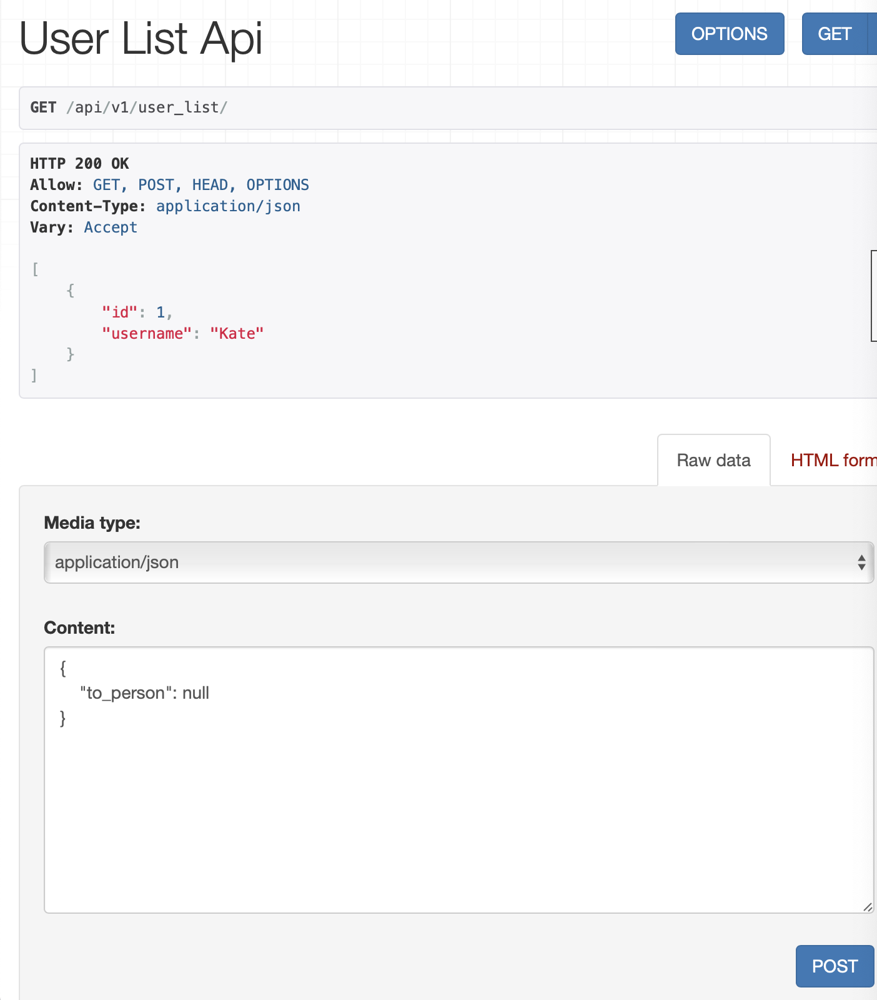

# Api description
## Endpoints:
### /swagger/
OpenAPI с swagger-ом

### /redoc/
OpenAPI с redoc-ом

### /api/v1/friend_list/
Список всех друзей пользователя

### /api/v1/friend_list/delete/{id}/
Удаление дружбы с пользователем

### /api/v1/pending_list/
Список всех отправленных и полученных запросов в друзья

### /api/v1/pending_list/accept/{id}
Одобрение входящей заявки в друзья и добавление дружбы с соответствующим пользователем
### /api/v1/pending_list/delete/{id}
Отклонение входящей заявки в друзья

### /api/v1/user_list/
Список всех пользователей с возможностью отправить им заявку в друзья

### /auth/.../
Стандартная регистрация, активации аккаунта, смена пароля и т.д.
